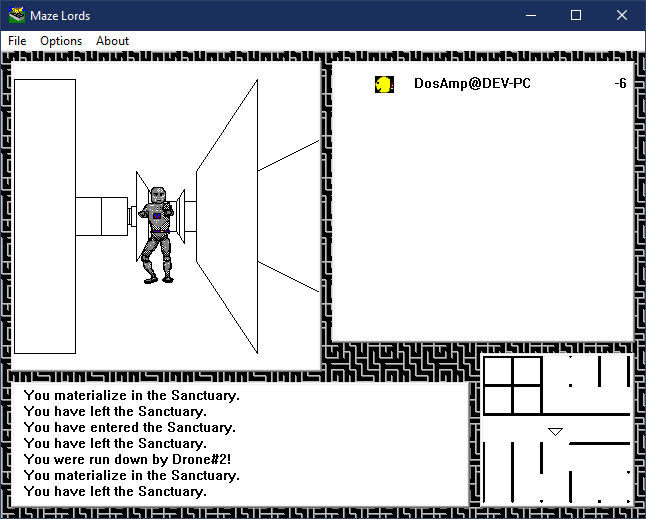

# Maze Lords

This is an example Win32 application from the Visual C++ 2.0 CD that I ported
to Win64.

## Building

Debug build: `nmake /f mazelord64.mak`

Release build: `nmake /f mazelord64.mak CFG="Win32 (x64) Release"`
